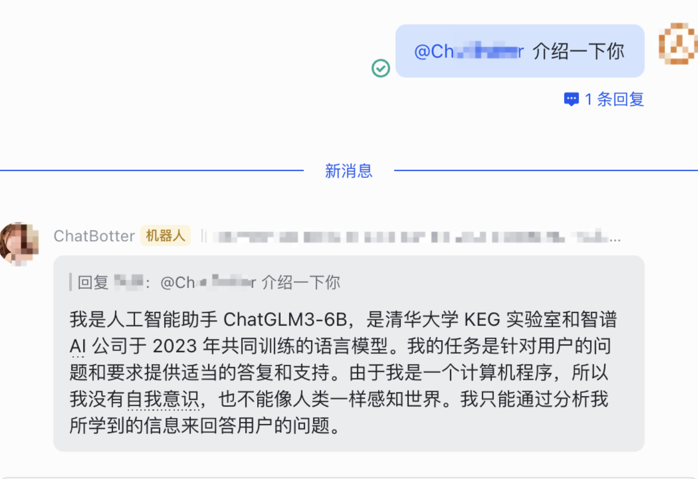
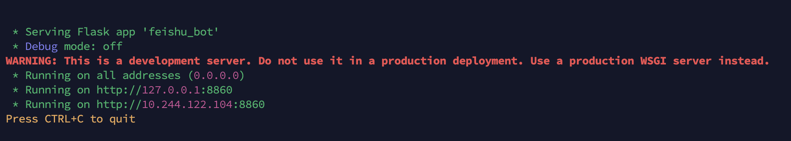

# Feishu-ChatGLM
🚀 Integrate ChatGLM-3-6B with Feishu App Bot to create an intelligent chatbot. Follow the steps to prepare the model and set up the Feishu application.
> Reference https://github.com/ConnectAI-E/Feishu-ChatGLM

## ✨ Function List
- [X] 飞书群中@`BOT_NAME`进行对话
- [X] 单聊、群聊自动记忆上下文
- [X] 使用 `/new` 命令开启新会话
- [X] 使用新飞书API接口
- [ ] 加入多模态模型，如 Stable-Diffusion

## Chat shot


## Local Deployment Method

### Step 1. 启动 chatGLM 的api
1. 此步骤可以在本机，也可以在服务器等其他机器，即 `src/chatglm_sever` 这个模块可以移至其他任何地方运行
2. 安装conda环境，切换conda环境（步骤略）
3. `cd ./src/chatglm_server`
4. `pip install -r requirements.txt`  安装 python 依赖包, pytorch 的安装会要比较长的时间
5. `cp config-example.yml config.yml`修改其中`# chatGLM 配置`部分
6. `python chatglm_server.py` 启动 chatGLM api 服务，第一次启动需要下载 chatGLM 模型(需要梯子)，时间会比较久，默认是 'THUDM/chatglm3-6b' 
7. 默认支持cpu、gpu、多卡gpu进行部署，调整脚本`server.py`的`main`部分
8. 记录好部署ip地址和端口号（如果为本机和默认配置，则为 `http://localhost:8860`

详细流程见[ChatGLM官方Github](https://github.com/THUDM/ChatGLM-6B) 

### STEP2 启动飞机机器人所需服务
1. `cd ..` 回到项目根目录 
2. `vim config.yml` 根据yml文件中的提示修改配置  
3. `pip install -r requirements.txt`  安装 python 依赖包
4. run `python3 src/main.py`


### STEP3 创建飞书机器人，并使用测试用的公网地址  
- 前往开发者平台创建应用,并获取到 APPID 和 Secret
- 前往应用功能-机器人, 创建机器人
- 从 cpolar、serverless 或 Railway 获得公网地址，在飞书机器人后台的 事件订阅 板块填写。例如，
`http://xxxx.r6.cpolar.top`为 cpolar 暴露的公网地址
`/webhook/event`为统一的应用路由
最终的回调地址为 `http://xxxx.r6.cpolar.top/webhook/event`
- 在事件订阅板块，搜索三个词机器人进群、 接收消息、 消息已读, 把他们后面所有的权限全部勾选。 进入权限管理界面，搜索图片, 勾选获取与上传图片或文件资源。 最终会添加下列回调事件
```
im:resource(获取与上传图片或文件资源)
im:message
im:message.group_at_msg(获取群组中所有消息)
im:message.group_at_msg:readonly(接收群聊中@机器人消息事件)
im:message.p2p_msg(获取用户发给机器人的单聊消息)
im:message.p2p_msg:readonly(读取用户发给机器人的单聊消息)
im:message:send_as_bot(获取用户在群组中@机器人的消息)
im:chat:readonly(获取群组信息)
im:chat(获取与更新群组信息)
```